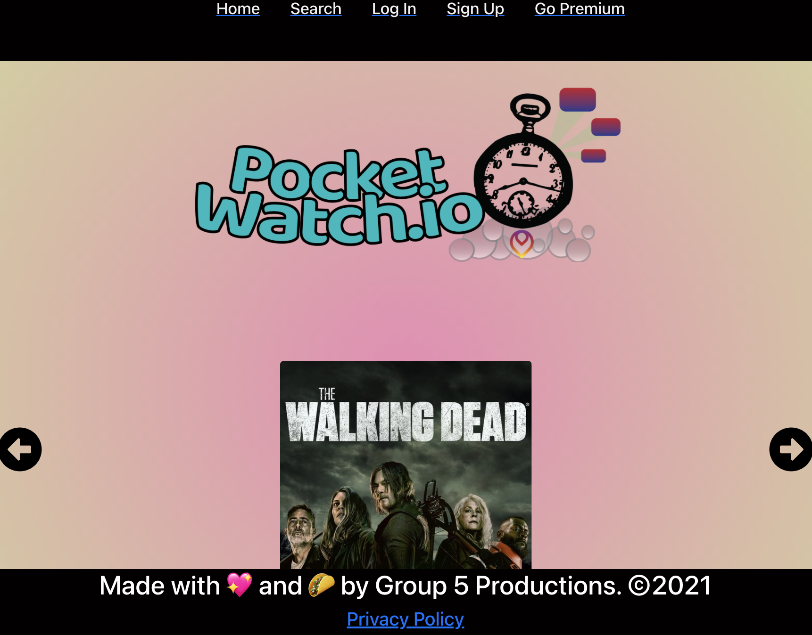
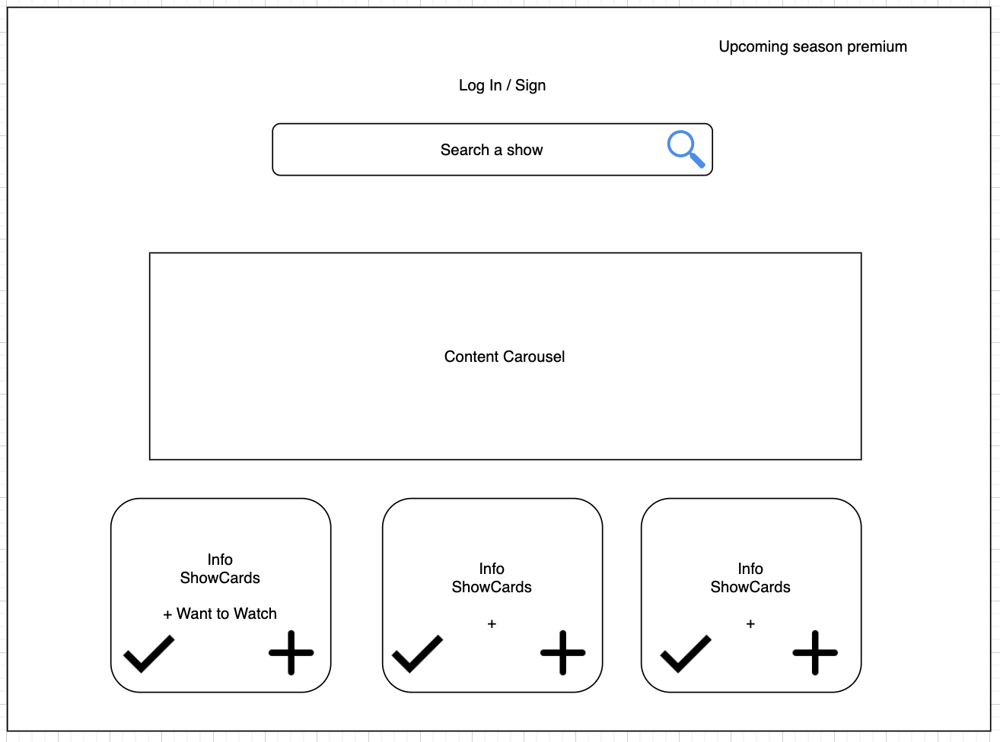
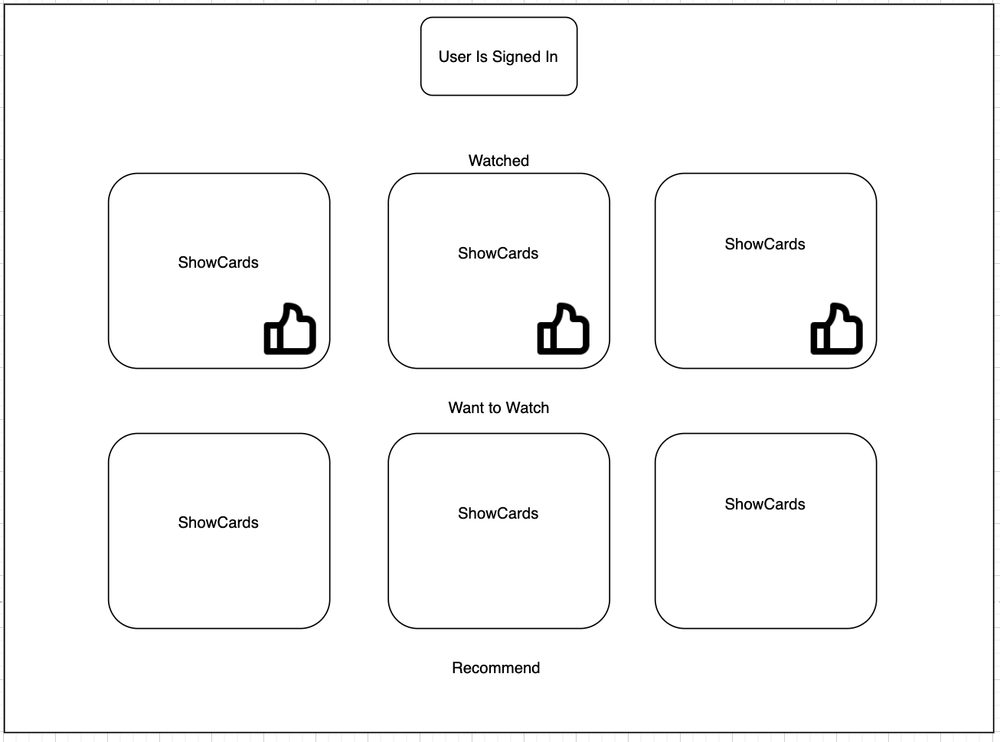
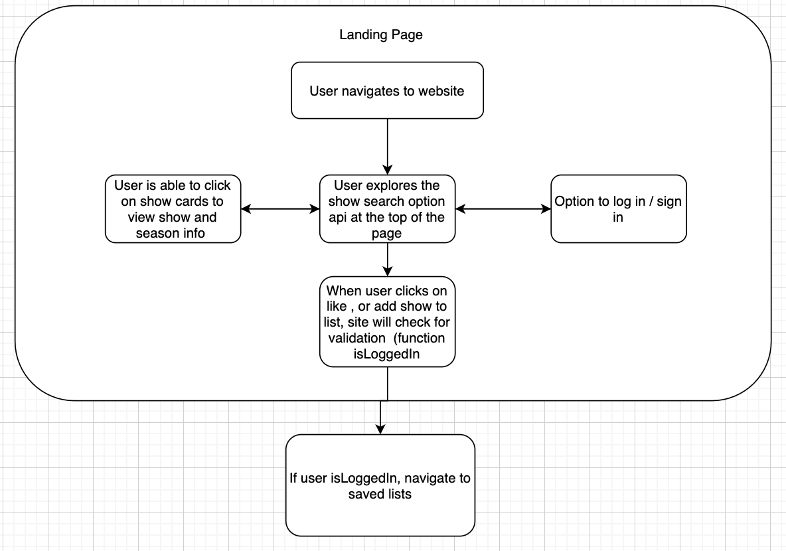
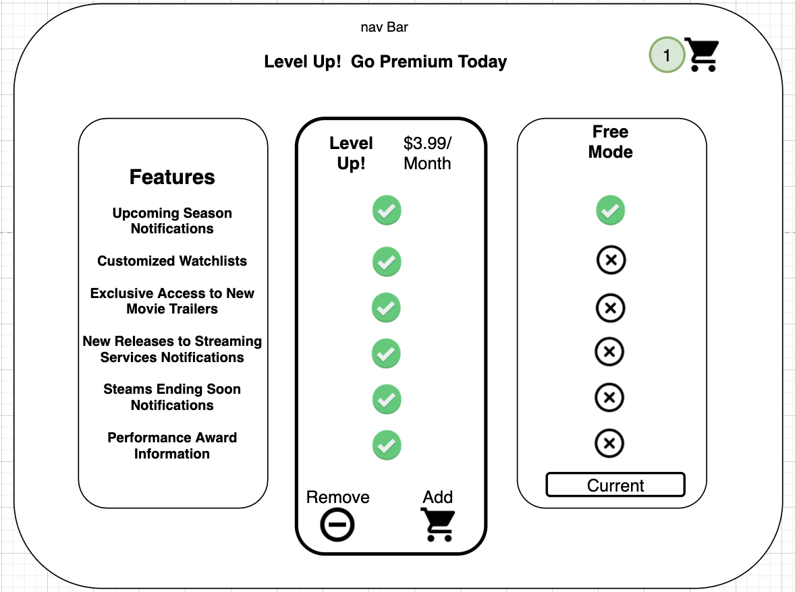

# PocketWatch.io ©2021 

## Description
Pocket.io is a movie tracker app which is built using React, mongoDB. This web app uses the Movie API to display the movie overviews.

<<<<<<< HEAD
* User can sign up [Sign-Up](https://w4tch-tow3r.herokuapp.com/SignUp)
* User can log in [Log-in](https://w4tch-tow3r.herokuapp.com/LogIn)
* User can access the premium feature [Go-Premium](https://w4tch-tow3r.herokuapp.com/GoPremium)
* User can search for any movie on the search tab [Search](https://w4tch-tow3r.herokuapp.com/Search)
* User can get a notification for the upcoming movies too [Movie-List](https://w4tch-tow3r.herokuapp.com/MyLists)
=======
* [https://w4tch-tow3r.herokuapp.com/LogIn] User can login
* [https://w4tch-tow3r.herokuapp.com/SignUp] User Can Sign up
* [https://w4tch-tow3r.herokuapp.com/GoPremium] User can access the premium feature
* [https://w4tch-tow3r.herokuapp.com/Search] User can search for any movie on the search tab 
* [https://w4tch-tow3r.herokuapp.com/MyLists] User can get a notification for the upcoming movies too
>>>>>>> bfcc6bf39352041b755039775e19b0fe7a3bb53a

Project by: Andrew Core, Deja Martin, Aimee Jesso, Jagraj Singh  
Main Github: 
[fraudwheeldrive](https://github.com/fraudwheeldrive)
[MissAimeeJay](https://github.com/MissAimeeJay)

Repository Link: https://github.com/fraudwheeldrive/tracker  
Live Page Url:  https://w4tch-tow3r.herokuapp.com/

## Table of Contents
* [Installation](#installation)
* [Usage](#usage)
* [Contributon](#credits)
* [License](#license)
* [Testing](#testing)
* [Questions](#questions)

## Installation
This app is available from the Heroku link listed above.  If the repository viewer wishes to download and install the node packages required to run the application from the command line, they may do so by cloning the repository and entering `npm install` from the root folder which will intall dependencies into all folders that require them.

## Usage 
1. Git clone the repo in the desired local folder
2. Cd to the root folder and start the project
3. npm run deploy
4. The should automatically open at http://localhost:3000

## Contribution   
* [Andrew Core](https://github.com/fraudwheeldrive)
* [Aimee Jesso](https://github.com/MissAimeeJay)
* [Deja Martin](https://github.com/dejagraver)
* [Jagraj Singh](https://github.com/ITJagraj)

## License
The Unlicense
[Click here for more information on this license](https://choosealicense.com/licenses/unlicense)

## Testing
To run test, run npm run test in the client directory of the application

## Questions
If you have questions or would like to contact for other reasons, please contact
<<<<<<< HEAD
 
* Aimee Jesso   Email: ajesso@post.com [Github](https://github.com/MissAimeeJay)
* Jagraj Singh  Email: singh.jagraj96@yahoo.com [Github](https://github.com/ITJagraj)
* Andrew Core   Email: adcore89gmail.com [Github](https://github.com/fraudwheeldrive)
* Deja Martin   Email: dejaamaartin@gmail.com [Github](https://github.com/dejagraver)
=======
Andrew Core, Deja Martin, Aimee Jesso, Jagraj Singh  
Email: ajesso@post.com
Main Github: [MissAimeeJay](https://github.com/MissAimeeJay)
=======
Email: singh.jagraj96@yahoo.com
Email: adcore89gmail.com
Email: dejaamaartin@gmail.com
>>>>>>> bfcc6bf39352041b755039775e19b0fe7a3bb53a
